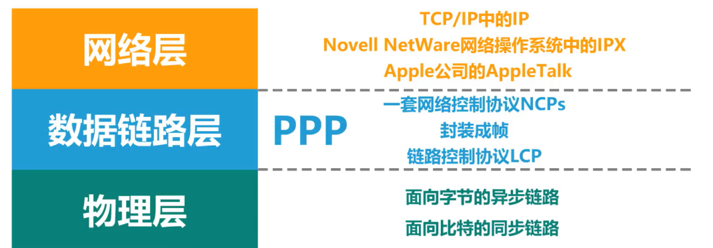
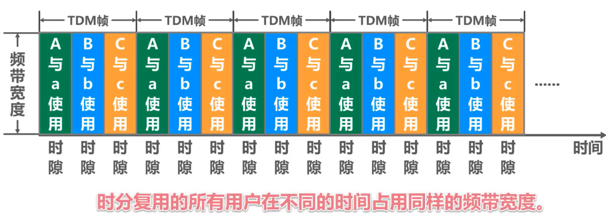

# 数据链路层

**链路**是从一个结点到相邻结点的一段物理线路，**数据链路**则是在链路的基础上增加了一些必要的硬件（如网络适配器）和软件（如协议的实现）

# 基本问题

## 1.封装成帧

信息在数据链路层以帧的形式传送，所以要将网络层传下来的分组添加首部和尾部构成数据帧,首部尾用于标记帧的开始和结束。

+ 并非所有的数据链路层**协议的帧定界中**都有 **帧定界标志，**比如以太网V2 则没有，它是依靠物理层添加的前导码来进行区分帧定界。

## 2.透明传输

在传送过程中，帧使用首部和尾部进行定界，如果帧的数据部分含有和首部尾部相同的内容，那么帧的开始和结束位置就会被错误的判定。需要在数据部分出现首部尾部相同的内容前面插入转义字符。如果数据部分出现转义字符，那么就在转义字符前面再加个转义字符。在接收端进行处理之后可以还原出原始数据。

> 面向字节的物理链路使用字节填充（或者字符填充）的方法实现透明传输
>
> 面向比特的物理链路使用比特填充的方法实现透明传输。扫描数据部分每5个联系的比特1后添加一个比特0，接受的时候去除添加的0。

## 3. 差错检测

目前数据链路层广泛使用了循环冗余检验（CRC）来检查比特差错。

>如果数据链路层向其上层提供的是不可靠服务，那么丢弃就丢弃了，不会再有更多措施。
>
>如果数据链路层向其上层提供的是可靠服务，那就还需要其他措施，来确保接收方主机还可以重新收到被丢弃的这个帧的正确副本。

# 数据链路层使用的信道

## 1.点对点信道

一对一通信。

因此不会发生碰撞，比较简单使用PPP协议进行控制。

## 2.广播信道

一对多通信，一个节点发送的信息能被整个广播信道所有的节点收到。（也可以指定MAC地址）。

所有的节点都在同一个广播信道上发送数据，因此需要有专门的控制方法进行协调，避免发生冲突（冲突也叫碰撞）。

主要有两种控制方法进行协调，一个是使用信道复用技术，一是使用 CSMA/CD 协议。

# 可靠传输

**比特差错**只是传输差错的一种。

从整个计算机网络体系结构来看，传输差错包括，**分组丢失，分组重复，分组失序**，这些通常在网络层。

可靠传输服务不仅局限于数据链路层，其他各层均可实现可靠传输。

可靠传输的实现比较复杂，开销也比较大，是否使用可靠传输取决于应用需求。

## 三种可靠协议

+ 停止-等待协议SW
+ 回退N帧协议GBN
+ 选择重传协议SR

> 这三种可靠传输实现机制的基本原理并不仅限于数据链路层，可以应用到计算机网络体系结构的各层协议中

# PPP协议

互联网用户通常需要连接到某个 ISP 之后才能接入到互联网，PPP 协议是用户计算机和 ISP 进行通信时所使用的数据链路层协议。

在广域网中路由器与路由器之间的通信通常也是使用ppp协议。

>PPP协议在为点对点链路传输各种协议数据报提供了一个标准方法，主要由一下三部分构成：
>
>* 对各种协议数据报的封装方法（封装成帧）。
>* 链路控制协议LCP    用于建立，配置以及测试数据链路的连接
>* 一套网络控制协议NCPs   其中的每一个协议支持不同的网络层协议
>
>

PPP 的帧格式：

>+ F 字段为帧的定界符
>+ A 和 C 字段暂时没有意义
>+ FCS 字段是使用 CRC 计算出的校验码
>+ 信息部分的长度不超过 1500
>
>

# 信道复用技术

**复用是通信技术中的一个重要概念，复用就是通过一条物理线路同时传输多个用户的信号**。

当网络中传输媒介的传输容量大于多条单一信道传输的总通信量时，可利用复用技术在一条物理线路上建立多条通信信道来充分利用传输媒介的带宽。

## **频分复用FDM**

+ 将整个带宽分为多份，用户在分配到一定的频带后，在通信过程中自始至终都占用这个频带。
+ **频分复用**的所有用户在同样的时间**占用不同的带宽资源**（请注意，这里的“带宽”是频率带宽而不是数据的发送速率）。

## **时分复用TDM **

+ **时分复用**则是将时间划分为一段段等长的**时分复用帧（TDM帧）**。每一个时分复用的用户在每一个 TDM 帧中占用固定序号的时隙。
+ 每一个用户所占用的时隙是**周期性地出现**（其周期就是TDM帧的长度）的。
+ TDM 信号也称为**等时** (isochronous) 信号。
+ **时分复用的所有用户在不同的时间占用同样的频带宽度。**

> **使用频分复用和时分复用进行通信，在通信的过程中主机会一直占用一部分信道资源。但是由于计算机数据的突发性质，通信过程没必要一直占用信道资源而不让出给其它用户使用，因此这两种方式对信道的利用率都不高。**

## **波分复用 WDM**

波分复用就是光的频分复用，使用一根光纤来同时传输多个光载波信号

光信号传输一段距离后悔衰减，所以要用 掺铒光纤放大器 放大光信号

##  **码分复用 CDM**

## 码分复用

码分复用 CDM (Code Division Multiplexing)

为每个用户分配 m bit 的码片，并且所有的码片正交，对于任意两个码片  和  有

为了讨论方便，取 m=8，设码片  为 00011011。在拥有该码片的用户发送比特 1 时就发送该码片，发送比特 0 时就发送该码片的反码 11100100。

在计算时将 00011011 记作 (-1 -1 -1 +1 +1 -1 +1 +1)，可以得到

其中  为  的反码。

利用上面的式子我们知道，当接收端使用码片  对接收到的数据进行内积运算时，结果为 0 的是其它用户发送的数据，结果为 1 的是用户发送的比特 1，结果为 -1 的是用户发送的比特 0。

# CSMA/CD 协议

CSMA/CD 表示载波监听多点接入 / 碰撞检测。

总线型局域网使用的协议

+ **多点接入MA** ：多个站站点连接在一条总线上，竞争使用总线。
+ **载波监听CS** ：每个主机都必须不停地监听信道。在发送前，如果监听到信道正在使用，就必须等待。 **先听后说**。
+ **碰撞检测CD** ：在发送中，如果监听到信道已有其它主机正在发送数据，就表示发生了碰撞。虽然每个主机在发送数据之前都已经监听到信道为空闲，但是由于电磁波的传播时延的存在，还是有可能会发生碰撞。**边说边听**。

记端到端的传播时延为 τ，最先发送的站点最多经过 2τ 就可以知道是否发生了碰撞，称 2τ 为 **争用期** 。只有经过争用期之后还没有检测到碰撞，才能肯定这次发送不会发生碰撞。

当发生碰撞时，站点要停止发送，等待一段时间再发送。这个时间采用 **截断二进制指数退避算法** 来确定。从离散的整数集合 {0, 1, .., (2k-1)} 中随机取出一个数，记作 r，然后取 r 倍的争用期作为重传等待时间。

# CSMA/CA 协议

**无线局域网使用的协议：CSMA/CA**
**为什么无线局域网要使用CSMA/CA协议**

# MAC地址

MAC 地址是链路层地址，长度为 6 字节（48 位），用于唯一标识网络适配器（网卡）。

一台主机拥有多少个网络适配器就有多少个 MAC 地址。例如笔记本电脑普遍存在无线网络适配器和有线网络适配器，因此就有两个 MAC 地址。

>+ 使用点对点信道的数据链路层不需要使用地。
>+ 使用广播信道的数据链路层必须使用地址来区分各主机。

# 集线器与交换机

**集线器**

+ 传统以太网最初是使用粗同轴电缆，后来演进到使用比较便宜的细同轴电缆，最后发展为使用更便宜和更灵活的双绞线。
+ 采用双绞线的以太网采用星形拓扑，在星形的中心则增加了一种可靠性非常高的设备，叫做**集线器** (hub)。
+ **集线器**是也可以看做多口中继器，每个端口都可以成为一个中继器，中继器是对减弱的信号进行放大和发送的设备
+ **集线器**的以太网在逻辑上仍是个总线网，需要使用CSMA/CD协议来协调各主机争用总线，只能工作在半双工模式，收发帧不能同时进行

**集线器-在物理层扩展以太网**

**交换机**

+ 扩展以太网更常用的方法是在数据链路层进行。
+ 早期使用**网桥**，现在使用**以太网交换机**。

>**网桥**
>
>+ 网桥工作在数据链路层。
>+ 它根据 MAC 帧的目的地址对收到的帧进行转发和过滤。
>+ 当网桥收到一个帧时，并不是向所有的接口转发此帧，而是先检查此帧的目的MAC 地址，然后再确定将该帧转发到哪一个接口，或把它丢弃。
>
>**交换机**
>
>+ 1990 年问世的交换式集线器 (switching hub) 可明显地提高以太网的性能。
>+ 交换式集线器常称为**以太网交换机** (switch) 或**第二层交换机** (L2 switch)，强调这种交换机工作在数据链路层。
>+ 以太网交换机实质上就是一个**多接口的网桥**

**集线器与交换机的区别**

> 使用**集线器**互连而成的共享总线式以太网上的某个主机，要给另一个主机发送单播帧，该单播帧会通过共享总线传输到**总线上的其他各个主机。**
>
> 使用交换机互连而成的交换式以太网上的某个主机，要给另一个主机发送单播帧，该单播帧进入交换机后，交换机会将该单播帧转发给目的主机，**而不是网络中的其他各个主机。**

## 虚拟局域网VLAN

 为什么要虚拟局域网VLAN

随着以太网规模的扩大，广播域也相应扩大，当网络过于庞大之后，广播风暴  难以管理和维护潜在的安全问题等都会出现， 每一次的广播都会消耗大量网络资源，因此我们需要缩小广播范围。

>  网络中会频繁的出现广播信息(TCP/IP协议栈中很多都会使用广播如：ARP,RIP,DHCP等)。

缩小广播域的方法：

​	一种是：使用路由分割广播域：路由器默认不会转发广播信号。但是价格昂贵。

​    一种是：虚拟局域网WLAN技术

 **虚拟局域网 VLAN** 是一种将区域网中的**设备划分与物理地址无关的逻辑组的技术**。

概念

**虚拟局域网优点**

虚拟局域网（VLAN）技术具有以下主要优点：

1. 改善了性能。
2. 简化了管理。
3. 降低了成本。
4. 改善了安全性。

