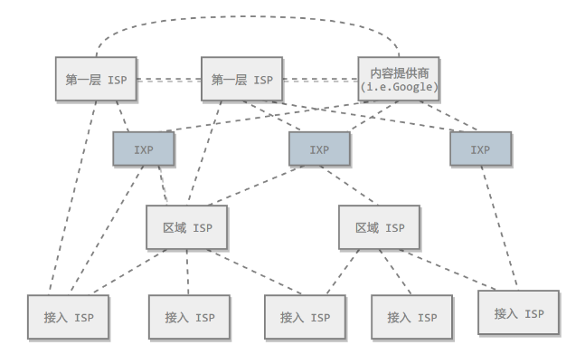
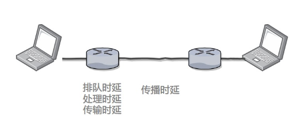
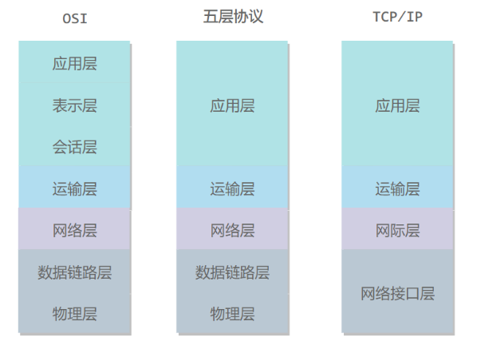

# 计算机网络概述

## 网路的网路

* 网络把主机连接起来，而互连网（internet）是把多种不同的网络连接起来，因此互连网是网络的网络。而互联网（Internet）是全球范围的互连网

## 因特网的组成

因特网的重要属性是**共享和连通性**。

* 边缘部分，由连接在因特网上的主机组成，这部分用户直接使用，用来通信和资源共享。
* 核心部分，大量网络和连接网路的路由器组成，这部分是位边缘部分提供服务。提供连通性和交换。

## ISP

* 互联网服务提供商ISP，可以从互联网管理机构获得许多ip地址同时拥有通信线路以及路由器等联网设备，个人或机构向 ISP 缴纳一定的费用就可以接入互联网 	。

* 目前的互联网是一种多层次 ISP 结构，ISP 根据覆盖面积的大小分为第一层 ISP（主干ISP）、区域 ISP 和本地 ISP。互联网交换点 IXP 允许两个 ISP 直接相连而不用经过第三个 ISP。

## 电路交换和分组交换

### 电路交换

电路交换用于电话通信系统，两个用户要通信之前需要建立一条专用的物理链路，并且在整个通信过程中始终占用该链路。由于通信的过程中不可能一直在使用传输线路，因此电路交换对线路的利用率很低，往往不到 10%。对于网络传输这个具有突发性的传输不使用这种交换。

### 分组交换

每个分组都有首部和尾部，包含了源地址和目的地址等控制信息，在同一个传输线路上同时传输多个分组互相不会影响，因此在同一条传输线路上允许同时传输多个分组，也就是说分组交换不需要占用传输线路。

在一个邮局通信系统中，邮局收到一份邮件之后，先存储下来，然后把相同目的地的邮件一起转发到下一个目的地，这个过程就是存储转发过程，分组交换也使用了存储转发过程。

## 时延

总时延 = 传输时延+ 排队时延 + 处理时延 + 传播时延

* 排队时延 
  * 分组在路由器等待的时间，取决于网络当前的通信量
* 处理时延
  * 主机或路由器收到分组时进行处理所需要的时间，例如分析首部、从分组中提取数据、进行差错检验等。
* 传输时延
  * 主机或路由器传输数据帧所需要的时间。
* 传播时延
  * 电磁波在信道中传播需要的时间，电磁波传播速度接近光速

## 计算机的网络体系

## 五层协议

* 应用层：主要任务就是**为应用程序提供传输服务** ,如例如 HTTP、DNS 等协议。数据单位为报文。
* 传输层：为进程提供通用数据传输服务。运输层包括两种协议：传输控制协议 TCP，提供面向连接、可靠的数据传输服务，数据单位为报文段；用户数据报协议 UDP，提供无连接、尽最大努力的数据传输服务，数据单位为用户数据报。TCP 主要提供完整性服务，UDP 主要提供及时性服务。
* 网络层：主要解决**多个网络之间通过路由器**的通信，其次是路由表的生成，选择合适的路线通过路由转发数据(他的数据传输单位 **分组 | IP数据报**)

+ **数据链路层** ：两台主机在一个网络上进行通信，数据链路层的任务是在两个相邻结点间的线路上无差错地传送以帧（frame）为单位的数据。每一帧包括数据和必要的控制信息，控制信息能能够使接收方检测有无出错，或者检错，这都是数据链路层的功能。。

+ **物理层** ：考虑的是怎样在传输媒体上传输数据比特流，而不是指具体的传输媒体。物理层的作用是尽可能屏蔽传输媒体和通信手段的差异，使数据链路层感觉不到这些差异。

## OSI

其中表示层和会话层用途如下：

+ **表示层** ：数据压缩、加密以及数据描述，这使得应用程序不必关心在各台主机中数据内部格式不同的问题。
+ **会话层** ：建立及管理会话。

五层协议没有表示层和会话层，而是将这些功能留给应用程序开发者处理。

## TCP/IP

它只有四层，相当于五层协议中数据链路层和物理层合并为网络接口层。

TCP/IP 体系结构不严格遵循 OSI 分层概念，应用层可能会直接使用 IP 层或者网络接口层。

