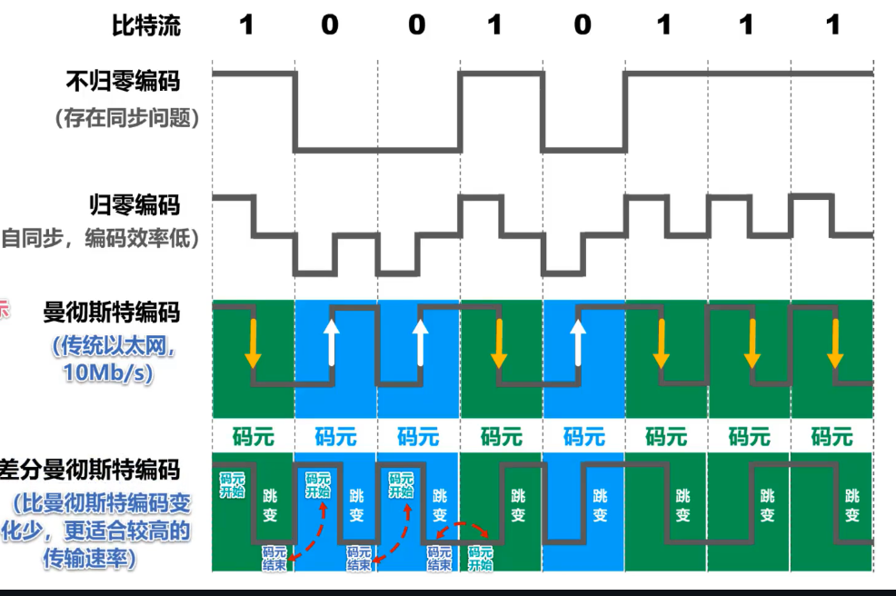

# 计算机网络 - 物理层

# 物理层的功能

物理层要处理的是如何在传输媒体上传输比特流，尽可能忽略不同的传输介质的影响，物理层的作用是尽可能屏蔽传输媒体和通信手段的差异。

物理层的任务主要是，规定传输媒体的接口有关的特性

> 机器特性 ：指明接口所用的接线器的形状和尺寸，引脚数目和排列，固定和锁定装置
>
> 电器特性：出现电平的范围
>
> 功能特性：出现某一电平表示的意义
>
> 过程特性：指明对于不同功能的各种可能时间出现顺序

# 传输媒介

* 传输媒介是数据传输系统中发送器和接收器之间的物理通路。
* 传输媒介有两大类，引导型传输媒介和非引导型传输媒介

传输媒介不输入物理层，（不属于计算机网络体系任意层）

## 导引型传输媒介

在导引型传输媒介中，电磁波被媒介引导沿着媒介传播。

* 同轴电缆

* ==双绞线==
  * 双绞线绞合的作用：减少部分来自==外界==和==相邻导线==的电磁干扰
* 光纤
  * 可以存在多条不同角度入射的光线在一条光纤中传输。这种光纤就称为**多模光纤**。
  * 若光纤的直径减小到只有一个光的波长，则光纤就像一根波导那样，它可使光线一直向前传播，而不会产生多次反射。这样的光纤称为**单模光纤**。

## 非导引型传输媒介
非导引型传输媒体是指自由空间。如无线电波，微波，红外线，可见光（HIFI）

# 编码与调制

在计算机网络中，常见的是将数字基带信号通过编码或调制的方法在相应信道进行传输

**常用术语**

+ **数据 (data)** —— 运送消息的实体。
+ **信号 (signal)** —— 数据的电气的或电磁的表现。
+ **模拟信号 (analogous signal)** —— 代表消息的参数的取值是连续的。
+ **数字信号 (digital signal)** —— 代表消息的参数的取值是离散的。
+ **码元 (code)** —— 在使用时间域（或简称为时域）的波形表示数字信号时，代表不同离散数值的基本波形。
+ **基带信号**（即基本频带信号）—— 来自信源的信号。像计算机输出的代表各种文字或图像文件的数据信号都属于基带信号。
+ 基带信号往往包含有较多的低频成分，甚至有直流成分，而许多信道并不能传输这种低频分量或直流分量。因此必须对基带信号进行**调制** (modulation)。

不归零编码，归零编码，曼彻斯顿编码，曼彻斯顿差分编码

**调制**

数字信号转换为模拟信号，在模拟信道中传输，例如WiFi，采用补码键控CCK/直接序列扩频DSSS/正交频分复用OFDM等**调制**方式。

# 传输方式

* 串行方式并行方式

  * 串行传输：数据是一个bite一个bite依次发送，发送方到接受方只需要一条线路即可，数据在传输线路上的传输往往采用串行传输。
  * 并行方式： 数据是一次发送n个bite。发送方到接受方只需要n条线路。价格比较高，常见在计算机内部CPU于内存之间的传输。

* 同步传输和异步传输

  > **同步传输**：
  >
  > + 数据块以稳定的比特流的形式传输。字节之间没有间隔。
  > + 接收端在每个比特信号的中间时刻进行检测，以判别接收到的是比特0还是比特1。
  > + 由于不同设备的时钟频率存在一定差异，不可能做到完全相同，在传输大量数据的过程中，所产生的判别时刻的累计误差，会导致接收端对比特信号的判别错位。
  >
  > 所以要使收发双发时钟保持同步。
  >
  > 保持同步的方法有添加一条时钟线同步，更好的方法是，在传输过程中将时钟信息编码到里面，如曼彻斯顿编码。
  >
  > 
  >
  > **异步传输**：
  >
  > + 以字节为独立的传输单位，字节之间的时间间隔不是固定
  > + 接收端仅在每个字节的起始处对字节内的比特实现同步
  > + 通常在每个字节前后分别加上起始位和结束位

# 通信方式

从通信的双方信息交互的方式来看，可以有以下三种基本方式：

**单向通信**：又称为**单工通信**，即只能有一个方向的通信而没有反方向的交互。无线电广播或有线电以及电视广播就属于这种类型

**双向交替通信**：又称为**半双工通信**，即通信的双方可以发送信息，但不能双方同时发送（当然也就不能同时接收）。这种通信方式使一方发送另一方接收，过一段时间后可以再反过来

**双向同时通信**：又称为**全双工通信**，即通信的双发可以同时发送和接收信息。

# 信道的极限容量

+ 任何实际的信道都不是理想的，在传输信号时会产生各种失真以及带来多种干扰。
+ 码元传输的速率越高，或信号传输的距离越远，或传输媒体质量越差，在信道的输出端的波形的失真就越严重。

失真的原因：

+ 码元传输的速率越高
+ 信号传输的距离越远
+ 噪声干扰越大
+ 传输媒体质量越差

奈氏准则和香农公式对比：

