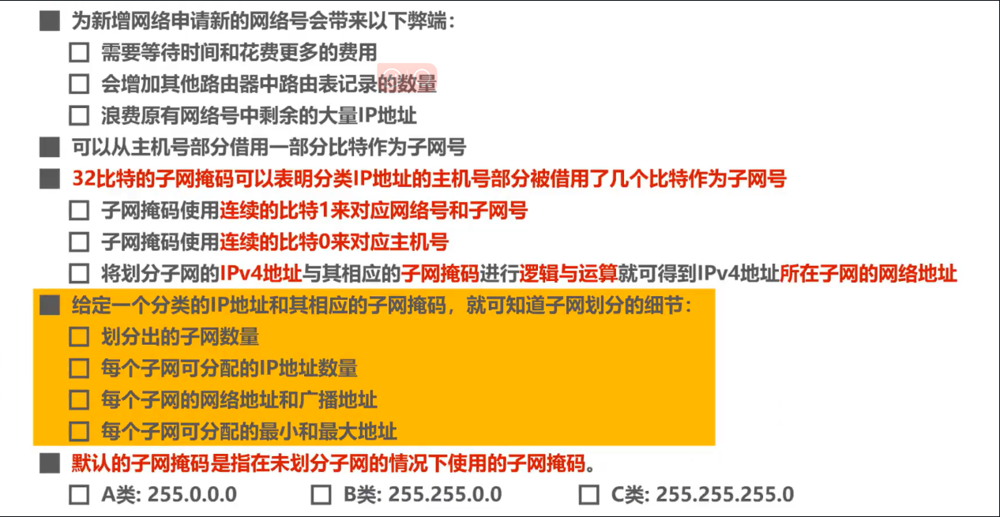
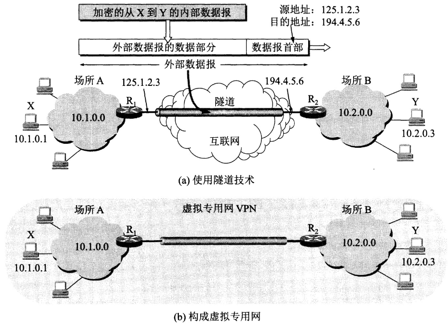

# 计算机网络-网络层

网络层的主要任务是**实现不同网络的互连**，进而实现数据包在各网络之间的传输。

> 各个网络如果只需要在内部通信，他们只要实现物理层和数据链路层即可。
>
> 如果将各个网络连接起来，形成一个更大的互联网，就需要实现网络层设备路由器。

因特网（Internet）是目前全世界**用户数量最多互联网**，它使用**TCP/IP**协议栈，在**TCP/IP协议栈**的网络层使用**网际协议IP**。因此其网络层称为网际层。

# 主要问题

## 网络层向运输层提供怎么样的服务

+ 在计算机网络领域，网络层应该向运输层提供怎样的服务（“**面向连接**”还是“**无连接**”）曾引起了长期的争论。
+ 争论焦点的实质就是：**在计算机通信中，可靠交付应当由谁来负责**？是**网络**还是**端系统**？

> ## 面向连接的虚电路服务

**一种观点：让网络负责可靠交付**

+ 这种观点认为，应借助于电信网（电路交换）的成功经验，让网络负责可靠交付，计算机网络应模仿电信网络，使用**面向连接**的通信方式。
+ 通信之前先建立**虚电路** (Virtual Circuit)，以保证双方通信所需的一切网络资源。
+ 如果再使用可靠传输的网络协议，就可使所发送的分组无差错按序到达终点，不丢失、不重复。

面向连接的虚电路补充

> 可靠通信由网络来保证。
>
> 必须建立网络层的连接------虚电路VC。
>
> 通信双方沿着已建立的虚电路发送分组。
>
> 目的主机地址仅在连接建立阶段使用，之后每个分组首部只需要携带一条虚电路的编号。（构成虚电路的每一段链路都有一个虚电编号）
>
> 如果再使用可靠传输的网络协议，就可使所发送的分组无差错按序到达终点，不丢失、不重复。
>
> 通信结束之后，需要释放之前所建立的虚电路。

> ## **无连接的数据报服务**

**另一种观点：无连接的数据报服务**

+ 互联网的先驱者提出了一种崭新的网络设计思路。
+ 网络层向上只提供简单灵活的、**无连接的**、**尽最大努力交付**的**数据报服务**，而不提供可靠服务。

**无连接的数据报服务补充**

> 可靠传输由用户主机保证。
>
> 不需要建立网络层连接。
>
> 每个分组可以走不同路径。
>
> 每个分组首部必须携带目的主机的完整地址。
>
> 这种通信方式传送的分组可能无码，丢失，重复，失序。
>
> 由于网络本身不提供端到端的可靠传输，这就是网络中的路由器可以做的比较简单，而且价格低廉（与电信网的交换机相比）。
>
> 因特网采用的这种设计思想，将复杂的网处理功能置于因特网的边缘(用户主机和内部的运输层)，而将相对简单的尽最大努力的分组交付功能至于因特网的核心。

> ## 面向连接的虚电路和无连接的数据包服务对比

## 网络层的寻址问题

网络层的寻址问题是指如何为网络中的每个设备分配一个唯一的地址，以便它们可以相互通信。 网络层的寻址方案通常是基于逻辑地址的，这些地址是由网络协议定义的。

## 路由的选择问题

路由器转发分组是通过路由表转发的，而路由表是通过各种算法得到的。路由选择算法分为静态路由算法和动态路由算法。静态路由算法由网络管理员手工配置路由信息，而动态路由算法则是根据网络拓扑结构和链路状态的变化自适应地调整路由表。

# 路由选择协议

路由选择协议都是自适应的，能随着网络通信量和拓扑结构的变化而自适应地进行调整。

互联网可以划分为许多较小的自治系统 AS，一个 AS 可以使用一种和别的 AS 不同的路由选择协议。

可以把路由选择协议划分为两大类：

+ 自治系统内部的路由选择：RIP 和 OSPF
+ 自治系统间的路由选择：BGP

### 1. 内部网关协议 RIP

RIP 是一种基于距离向量的路由选择协议。距离是指跳数，直接相连的路由器跳数为 1。跳数最多为 15，超过 15 表示不可达。

RIP 按固定的时间间隔仅和相邻路由器交换自己的路由表，经过若干次交换之后，所有路由器最终会知道到达本自治系统中任何一个网络的最短距离和下一跳路由器地址。

距离向量算法：

+ 对地址为 X 的相邻路由器发来的 RIP 报文，先修改报文中的所有项目，把下一跳字段中的地址改为 X，并把所有的距离字段加 1；
+ 对修改后的 RIP 报文中的每一个项目，进行以下步骤：
+ 若原来的路由表中没有目的网络 N，则把该项目添加到路由表中；
+ 否则：若下一跳路由器地址是 X，则把收到的项目替换原来路由表中的项目；否则：若收到的项目中的距离 d 小于路由表中的距离，则进行更新（例如原始路由表项为 Net2, 5, P，新表项为 Net2, 4, X，则更新）；否则什么也不做。
+ 若 3 分钟还没有收到相邻路由器的更新路由表，则把该相邻路由器标为不可达，即把距离置为 16。

RIP 协议实现简单，开销小。但是 RIP 能使用的最大距离为 15，限制了网络的规模。并且当网络出现故障时，要经过比较长的时间才能将此消息传送到所有路由器。

### 2. 内部网关协议 OSPF

开放最短路径优先 OSPF，是为了克服 RIP 的缺点而开发出来的。

开放表示 OSPF 不受某一家厂商控制，而是公开发表的；最短路径优先表示使用了 Dijkstra 提出的最短路径算法 SPF。

OSPF 具有以下特点：

+ 向本自治系统中的所有路由器发送信息，这种方法是洪泛法。
+ 发送的信息就是与相邻路由器的链路状态，链路状态包括与哪些路由器相连以及链路的度量，度量用费用、距离、时延、带宽等来表示。
+ 只有当链路状态发生变化时，路由器才会发送信息。

所有路由器都具有全网的拓扑结构图，并且是一致的。相比于 RIP，OSPF 的更新过程收敛的很快。

### 3. 外部网关协议 BGP

BGP（Border Gateway Protocol，边界网关协议）

AS 之间的路由选择很困难，主要是由于：

+ 互联网规模很大；
+ 各个 AS 内部使用不同的路由选择协议，无法准确定义路径的度量；
+ AS 之间的路由选择必须考虑有关的策略，比如有些 AS 不愿意让其它 AS 经过。

BGP 只能寻找一条比较好的路由，而不是最佳路由。

每个 AS 都必须配置 BGP 发言人，通过在两个相邻 BGP 发言人之间建立 TCP 连接来交换路由信息。

# 地址解析协议 ARP

网络层实现不同网络之间的通信，而链路层实现具体每段链路之间的通信。因此在通信过程中，IP 数据报的源地址和目的地址始终不变，而 MAC 地址随着链路的改变而改变。

>  ## ARP 实现由 IP 地址得到 MAC 地址。

每个主机都有一个 ARP 高速缓存，里面有本局域网上的各主机和路由器的 IP 地址到 MAC 地址的映射表。

如果主机 A 知道主机 B 的 IP 地址，但是 ARP 高速缓存中没有该 IP 地址到 MAC 地址的映射，此时主机 A 通过广播的方式发送 ARP 请求分组，主机 B 收到该请求后会发送 ARP 响应分组给主机 A 告知其 MAC 地址，随后主机 A 向其高速缓存中写入主机 B 的 IP 地址到 MAC 地址的映射。

# 网际控制报文协议ICMP

架构IP网络时需要特别注意两点：

+ 确认网络是否正常工作
+ 遇到异常时进行问题诊断

**而ICMP就是实现这些问题的协议**

ICMP的主要功能包括：

+ 确认IP包是否成功送达目标地址。
+ 通知在发送过程当中IP包被废弃的具体原因。
+ 改善网络设置等。

总的来说ICMP 是为了更有效地转发 IP 数据报和提高交付成功的机会。

>  ICMP 报文分为差错报告报文和询问报文。

> #### 终点不可达
>
> 当**路由器或主机不能交付数据报时**，就向**源点发送终点不可达报文**。具体可再根据ICMP的代
>
> 码字段细分为**目的网络不可达**、**目的主机不可达、目的协议不可达**、**目的端口不可达**、目**的网络未**
>
> **知**、**目的主机未知**等**13种错误。**
>
> #### 时间超过
>
> 当路由器收到一个目的IP地址需要跳到下一个路由，会将其生存时间**TTL字段的值减1**。若结
>
> 果不为0,则将该IP数据报转发出去;若结果为0,**丢弃该数据报并且向源点发送时间超过报文，**另外。
>
> 当终点在**预先规定的时间内不能收到一个数据报的全部数据报片时**，**丢弃已接受的数据并且向源点**
>
> **发送时间超过报文。**
>
> #### 参数问题
>
> 当路由器或目的主机收到IP数据报后,**根据其首部中**的**检验和字段**发现首部在**传输过程中出现了误码**，**就丢弃该数据报，并向源点发送参数问题报文。**
>
> #### 改变路由(重定向)
>
> **路由器**把**改变路由报文发送给主机**，让主机知道**下次应将数据报发送给另外的路由器**(可通过更好的路由)。

## Ping

Ping 是ICMP的一个重要应该，用来测试两台主机之间的联通性。

Ping的原理是通过向目的主机发送ICMP Echo 请求报文，目的主机收到之后会发送Echo回答报文，Ping会根据时间和成功响应的次数估算数据包往返时间以及丢包率。

## Tracerouter

Traceroute 是 ICMP 的另一个应用，用来跟踪一个分组从源点到终点的路径。

命令：`teacert +地址`

原理

+ 源主机向目的主机发送一连串的 IP 数据报。第一个数据报 P1 的生存时间 TTL 设置为 1，当 P1 到达路径上的第一个路由器 R1 时，R1 收下它并把 TTL 减 1，此时 TTL 等于 0，R1 就把 P1 丢弃，并向源主机发送一个 ICMP 时间超过差错报告报文；
+ 源主机接着发送第二个数据报 P2，并把 TTL 设置为 2。P2 先到达 R1，R1 收下后把 TTL 减 1 再转发给 R2，R2 收下后也把 TTL 减 1，由于此时 TTL 等于 0，R2 就丢弃 P2，并向源主机发送一个 ICMP 时间超过差错报文。
+ 不断执行这样的步骤，直到最后一个数据报刚刚到达目的主机，主机不转发数据报，也不把 TTL 值减 1。但是因为数据报封装的是无法交付的 UDP，因此目的主机要向源主机发送 ICMP 终点不可达差错报告报文。
+ 之后源主机知道了到达目的主机所经过的路由器 IP 地址以及到达每个路由器的往返时间。

# IP数据报的发送和转发过程

* 主机发送IP数据报，路由器转发IP数据报。

> ## 主机发送IP数据报

在同一网络中，直接交付。

> ## 路由转发IP数据报

若不在发送方和接受方不在同一网络中，则需要路由器转发。

用户为了让本网络中的主机能和其他网络中的主机进行通信，就必须给其指定本网络的一个路由器的接口，由该路由器帮忙进行转发，**所指定的路由器**，也被称为**默认网关**。

> 路由器收到IP数据报后如何转发？
>
> + 检查IP数据报首部是否出错：
>   + 若出错，则直接丢弃该IP数据报并通告源主机
>   + 若没有出错，则进行转发
> + 根据IP数据首部提取目的主机的ip地址，在**路由表**中查找匹配的条目：
>   + 若找到匹配的条目，则转发给条目中指示的下一跳路由器
>   + 若找不到，则丢弃该数据报并通告源主机

# IPv4地址

IP地址是一种在互联网上的给主机编址的方式，它主要是为互联网上**每一台主机**或者**路由器的每个接口**分配一个全球范围唯一的标识符。通常由32位二进制数表示，但是为了方便记忆，通常会将其转换为点分十进制表示法如192.168.1.1。但是2011年ipV4已经分配完，启用ipv6。

## 分类编址

由两部分组成，网络号和主机号，其中不同分类具有不同的网络号长度，并且是固定的。

IP 地址 ::= {< 网络号 >, < 主机号 >}

**A类地址**

**B类地址**

**C类地址**

## 划分子网

通过在主机号字段中拿一部分作为子网号，把两级 IP 地址划分为三级 IP 地址。

IP 地址 ::= {< 网络号 >, < 子网号 >, < 主机号 >}

要使用子网，必须配置子网掩码。一个 B 类地址的默认子网掩码为 255.255.0.0，如果 B 类地址的子网占两个比特，那么子网掩码为 11111111 11111111 11000000 00000000，也就是 255.255.192.0。

注意，外部网络看不到子网的存在。

> ## 划分子网的细节

> ## 划分子网总结

## 无分类划分
**为什么使用无分类编址**

> 划分子网在一定程度上缓解了因特网在发展中遇到的困难，但是数量巨大的C类网因为在地址空间太小并没有得到充分的使用，而因特网的ip地址仍在消耗，整个IPv4地址空间面临全部耗尽的威胁。
>
> 为此因特网工程任务组IETF又提出了采用**无分类编址**的方法来解决ip地址紧张的问题，同时成立IPv6工作组负责研究新版本IP以解决IP地址耗尽问题。
>
> 1993年，IETF发布**无分类域间路由选择CIDR**的RFC文档。
>
> **CIDR**消除了传统的A,B,C类地址，以及划分子网的概念；
>
> **CIDR**可以更加有效的分配IPv4地址空间，并且可以在新的IPv6使用之前允许因特网的规模持续增长。

无分类编址 CIDR 消除了传统 A 类、B 类和 C 类地址以及划分子网的概念，使用网络前缀和主机号来对 IP 地址进行编码，网络前缀的长度可以根据需要变化。

IP 地址 ::= {< 网络前缀号 >, < 主机号 >/网络前缀长度}

CIDR 的记法上采用在 IP 地址后面加上网络前缀长度的方法，例如 128.14.35.7/20 表示前 20 位为网络前缀。

如

> ## 路由聚合

一个 CIDR 地址块中有很多地址，一个 CIDR 表示的网络就可以表示原来的很多个网络，并且在路由表中只需要一个路由就可以代替原来的多个路由，减少了路由表项的数量。把这种通过使用网络前缀来减少路由表项的方式称为**路由聚合**，也称为 **构成超网** 。

# 路由选择协议

# 虚拟专用网

由于 IP 地址的紧缺，一个机构能申请到的 IP 地址数往往远小于本机构所拥有的主机数。并且一个机构并不需要把所有的主机接入到外部的互联网中，机构内的计算机可以使用仅在本机构有效的 IP 地址（专用地址）。

有三个专用地址块：

+ 10.0.0.0 ~ 10.255.255.255
+ 172.16.0.0 ~ 172.31.255.255
+ 192.168.0.0 ~ 192.168.255.255

VPN 使用公用的互联网作为本机构各专用网之间的通信载体。专用指机构内的主机只与本机构内的其它主机通信；虚拟指好像是，而实际上并不是，它有经过公用的互联网。

下图中，场所 A 和 B 的通信经过互联网，如果场所 A 的主机 X 要和另一个场所 B 的主机 Y 通信，IP 数据报的源地址是 10.1.0.1，目的地址是 10.2.0.3。数据报先发送到与互联网相连的路由器 R1，R1 对内部数据进行加密，然后重新加上数据报的首部，源地址是路由器 R1 的全球地址 125.1.2.3，目的地址是路由器 R2 的全球地址 194.4.5.6。路由器 R2 收到数据报后将数据部分进行解密，恢复原来的数据报，此时目的地址为 10.2.0.3，就交付给 Y。

# 网络地址转换 NAT

专用网内部的主机使用本地 IP 地址又想和互联网上的主机通信时，可以使用 NAT 来将本地 IP 转换为全球 IP。

在以前，NAT 将本地 IP 和全球 IP 一一对应，这种方式下拥有 n 个全球 IP 地址的专用网内最多只可以同时有 n 台主机接入互联网。为了更有效地利用全球 IP 地址，现在常用的 NAT 转换表把传输层的端口号也用上了，使得多个专用网内部的主机共用一个全球 IP 地址。使用端口号的 NAT 也叫做网络地址与端口转换 NAPT。

